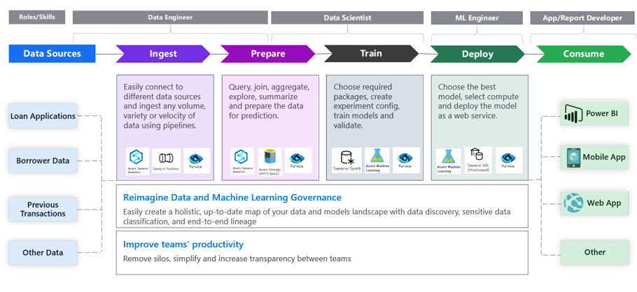
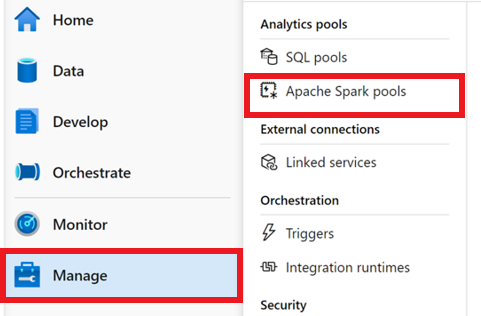

## About this Repository 

Azure Purview is a unified data governance service that helps you manage and govern data across different sources. This solution accelerator helps developers with all the resources needed to build an end-to-end lineage in Purview for Machine Learning scenarios.

## Prerequisites
To use this solution accelerator, you will need access to an [Azure subscription](https://azure.microsoft.com/free/). While not required, a prior understanding of Azure Purview, Azure Synapse Analytics and Machine Learning will be helpful.

For additional training and support, please see:

1. [Azure Purview](https://azure.microsoft.com/en-us/services/purview/) 
2. [Azure Synapse Analytics](https://azure.microsoft.com/en-us/services/synapse-analytics/) 
3. [Azure Machine Learning](https://azure.microsoft.com/en-us/services/machine-learning/) 

## Getting Started
Start by deploying the required resources to Azure. The button below will deploy Azure Purview, Azure Synapse Analytics, Azure Machine Learning and its related resources:

If you prefer to setup manually, you need to deploy Azure Purview, Azure Synapse Analytics, Azure Machine Learning

### Step 1. Download Files
Clone or download this repository and navigate to the project's root directory.

### Step 2. Purview Security Access

#### Step 2.1 Create a Service Principal for Purview Rest API access
[Create a service principal](https://docs.microsoft.com/en-us/azure/purview/tutorial-using-rest-apis#create-a-service-principal-application)

#### Step 2.2 Configure your Purview catalog to trust the service principal
[Configure your Purview catalog to trust the service principal](https://docs.microsoft.com/en-us/azure/purview/tutorial-using-rest-apis#configure-your-catalog-to-trust-the-service-principal-application)

### Step 3. Synapse Security Access

#### Step 3.1 Add your IP address to Synapse firewall
Before you can upload assests to the Synapse Workspace you will need to add your IP address:
1. Go to the Synapse resouce you created in the previous step. 
2. Navigate to `Firewalls` under `Security` on the left hand side of the page.
3. At the top of the screen click `+ Add client IP`
      
4. Your IP address should now be visable in the IP list

#### Step 3.2: Update storage account permisions 
In order to perform the necessary actions in Synapse workspace, you will need to grant more access.
1. Go to the Azure Data Lake Storage Account created above
2. Go to the `Access Control (IAM) > + Add > Add role assignment` 
3. Now click the Role dropdown and select `Storage Blob Data Contributor`
    - Search for your username and add
4. Click `Save` at the bottom

[Learn more](https://docs.microsoft.com/azure/synapse-analytics/security/how-to-set-up-access-control)

### Step 4. Upload CreditRisk Sample Dataset
1. Launch the Synapse workspace [Synapse Workspace](https://ms.web.azuresynapse.net/)
2. Select the `subscription` and `workspace` name you are using for this solution accelerator
3. In Synapse Studio, navigate to the `Data` Hub
4. Select `Linked`
5. Under the category `Azure Data Lake Storage Gen2` you'll see an item with a name like `xxxxx(xxxxx- Primary)`
6. Select the container named `Data (Primary)`
7. Select `Upload` and select `loan.csv` and `borrower.csv` files downloaded from [Data](./Data/) folder

### Step 5. Upload Assets and Run Noteboks
1. Launch the Synapse workspace [Synapse Workspace](https://ms.web.azuresynapse.net/)
2. Go to the `Manage` tab in the Synapse workspace and click on the `Apache Spark pools` 
    -  
3. Click `...` on the deployed Spark Pool and select `Packages`
4. Click `Upload` and select [requirements.txt](/Deployment/requirements.txt) from the cloned repo and click `Apply`  
    - 
5. Select the `subscription` and `workspace` name you are using for this solution accelerator
6. Go to `Develop`, click the `+`, and click `Import` to select all notebooks from the repository's `/Notebooks/` folder
7. For each of the notebooks, select `Attach to > spark1` in the top dropdown
8. Update Purview Tenant, Client Id and Secret from step `2.1` in `01_Authenticate_to_Purview_AML.ipynb`
9. Update Azure Machine Learning Tenant, Client Id and Secret in `01_Authenticate_to_Purview_AML.ipynb`
10. Update `account_name` variable to your ADLS in `04_Create_CreditRisk_Experiment.ipynb`
11. Run the following notebooks in order:
	- `01_Authenticate_to_Purview_AML.ipynb`
	- `02_Create_ML_Lineage_Types.ipynb`
	- `03_Create_ML_Lineage_Functions.ipynb`
	- `04_Create_CreditRisk_Experiment.ipynb`

### Step 6. Check Machine Learning Lineage in Purview Studio
1. Launch [Purview Studio](https://ms.web.purview.azure.com/)
2. Click on `Browse Assets`
3. Click on `Custom Model` and select the model we created from running notebooks in `Step 4`
4. Click on `Lineage`

## Contributing
This project welcomes contributions and suggestions.  Most contributions require you to agree to a Contributor License Agreement (CLA) declaring that you have the right to, and actually do, grant us the rights to use your contribution. For details, visit https://cla.opensource.microsoft.com.

When you submit a pull request, a CLA bot will automatically determine whether you need to provide a CLA and decorate the PR appropriately (e.g., status check, comment). Simply follow the instructions provided by the bot. You will only need to do this once across all repos using our CLA.

This project has adopted the [Microsoft Open Source Code of Conduct](https://opensource.microsoft.com/codeofconduct/). For more information see the [Code of Conduct FAQ](https://opensource.microsoft.com/codeofconduct/faq/) or contact [opencode@microsoft.com](mailto:opencode@microsoft.com) with any additional questions or comments.

## Trademarks
This project may contain trademarks or logos for projects, products, or services. Authorized use of Microsoft trademarks or logos is subject to and must follow [Microsoft's Trademark & Brand Guidelines](https://www.microsoft.com/en-us/legal/intellectualproperty/trademarks/usage/general). Use of Microsoft trademarks or logos in modified versions of this project must not cause confusion or imply Microsoft sponsorship. Any use of third-party trademarks or logos are subject to those third-party's policies.

## Data Collection
The software may collect information about you and your use of the software and send it to Microsoft. Microsoft may use this information to provide services and improve our products and services. You may turn off the telemetry as described in the repository. There are also some features in the software that may enable you and Microsoft to collect data from users of your applications. If you use these features, you must comply with applicable law, including providing appropriate notices to users of your applications together with a copy of Microsoft's privacy statement. Our privacy statement is located at https://go.microsoft.com/fwlink/?LinkID=824704. You can learn more about data collection and use in the help documentation and our privacy statement. Your use of the software operates as your consent to these practices.

